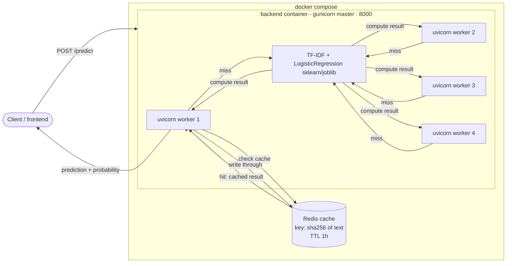
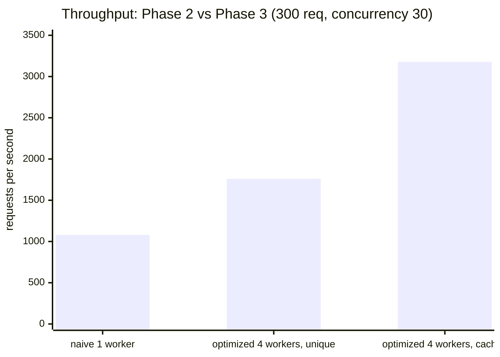
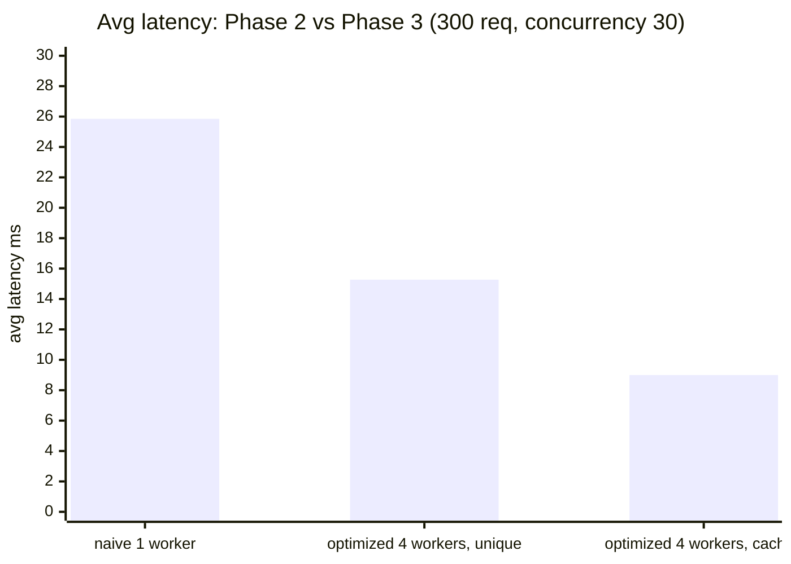
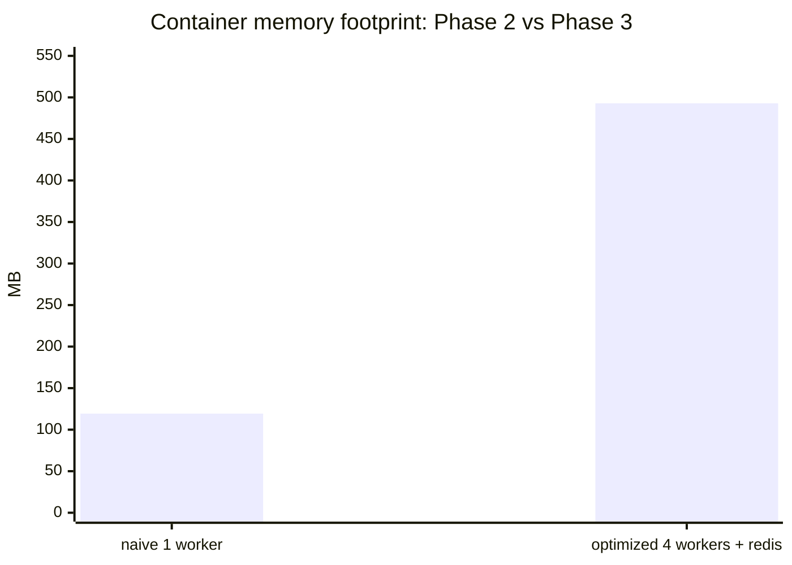

# Milestone 2: API, Frontend, Containerization, CI/CD

Serves the Milestone 1 disaster-tweet classifier (TF-IDF + Logistic
Regression, exported from the notebook) behind a REST API with a web UI.

## Structure

```
Milestone-2/
  backend/
    app.py              FastAPI app: /predict, /health
    vectorizer.joblib    exported from Milestone-1's notebook
    model.joblib
    requirements.txt
    requirements-dev.txt      pytest, httpx, ruff
    requirements-optimize.txt skl2onnx, onnx, onnxruntime, psutil, pandas
    optimize/
      export_onnx.py    exports the pipeline to ONNX, then quantizes it to INT8
      benchmark.py      naive (joblib) vs ONNX FP32 vs ONNX INT8: latency, memory, size, accuracy
      model_fp32.onnx   generated
      model_int8.onnx   generated
      results.json      generated
    tests/               unit + integration tests
    Dockerfile
  frontend/
    index.html           form UI
    app.js                fetch/formatting logic (testable, no DOM)
    tests/                node:test integration tests
    Dockerfile
  docker-compose.yml
  deploy.sh              one-command launch
```

## Run it

```bash
./deploy.sh
```

Builds both images, starts them, waits for the backend health check, then
prints the URLs:
- Frontend: http://localhost:8080
- Backend docs: http://localhost:8000/docs

Or manually: `docker compose up --build`.

## API

`POST /predict`
```json
{"text": "wildfire forces mass evacuation"}
```
→
```json
{"prediction": 1, "probability": 0.85}
```

`GET /health` → `{"status": "ok"}` (used by the Docker health check).

## Tests

Backend (`cd backend && pytest`): unit tests on the classification
threshold, integration tests hitting `/predict` through FastAPI's
`TestClient` (200 on valid input, correct disaster/non-disaster split,
422 on missing field).

Frontend (`cd frontend && node --test`): integration tests on the
fetch/format logic with a mocked `fetch` (success path, non-200 error,
label formatting).

## CI

`.github/workflows/ci.yml` runs on every push/PR to `main`: installs
dependencies, lints the backend with `ruff`, runs both test suites.

## Model-level optimization

1. **Model format optimization (ONNX).** `optimize/export_onnx.py` converts
   the fitted `Pipeline(vectorizer, model)` to ONNX via `skl2onnx`, so
   inference runs through `onnxruntime` instead of sklearn's Python path.
2. **Quantization (dynamic INT8, post-training).** The same script then runs
   `onnxruntime.quantization.quantize_dynamic` on the ONNX graph, converting
   the classifier's weight matrix from FP32 to INT8.

Run it:
```bash
pip install -r requirements-optimize.txt
python optimize/export_onnx.py     # writes model_fp32.onnx, model_int8.onnx
python optimize/benchmark.py --n 500
```

`benchmark.py` sends the same batch of requests (500 held-out tweets, the
same 80/20 stratified split Milestone-1 used) through all three model forms —
naive joblib, ONNX FP32, ONNX INT8 — one request at a time, each in its own
subprocess so memory readings aren't cross-contaminated. It reports average
latency, throughput, process RSS after model load, on-disk size, and
accuracy.

### Results (n=500 requests)

| mode      | avg latency (ms) | throughput (qps) | RSS after load (MB) | size (KB) | accuracy |
|-----------|-------------------|-------------------|-----------------------|-----------|----------|
| naive (joblib)  | 0.117 | 8,538  | 173.4 | 227.5 | 0.856 |
| ONNX FP32       | 0.061 | 16,484 | 183.3 | 160.1 | 0.858 |
| ONNX INT8       | 0.057 | 17,507 | 183.1 | 160.4 | 0.858 |

Full numbers in `optimize/results.json`.

**Takeaways:**
- The ONNX export is the bigger win here: ~2x higher throughput than the
  sklearn/joblib path, no accuracy loss.
- INT8 dynamic quantization gives a further small latency edge with no
  accuracy change, but barely moves file size or RSS at this scale: most of
  the ~160KB ONNX graph is the frozen TF-IDF vocabulary/IDF table (strings +
  float64 array for 5000 terms), not the classifier's weight matrix — dynamic
  quantization only touches the `Gemm` op's weights, which is a small slice
  of the total. On a model with a large dense weight matrix (not a 5000×1
  logistic regression), INT8 quantization would show a much bigger size/RSS
  delta.
- RSS after load is slightly *higher* for the ONNX modes than naive — that's
  fixed overhead from importing `onnxruntime` itself (numpy, protobuf, the
  runtime's own allocator warmup), not the model. It dominates at this model
  size; it wouldn't for a model large enough to actually stress memory.

## System & infrastructure-level optimization

1. **Concurrency (multi-worker gunicorn).** `backend/Dockerfile` runs
   `gunicorn app:app -k uvicorn.workers.UvicornWorker -w 4`, forking 4
   independent uvicorn/ASGI processes (own GIL, own core) behind one gunicorn
   master, instead of a single uvicorn process serializing all requests.
2. **Caching (Redis exact-match).** `/predict` hashes the input text
   (`sha256`) and checks Redis before running the vectorizer/model. A hit
   skips inference entirely; a miss computes then writes through with a 1
   hour TTL. Redis is unreachable-safe: connection errors are caught and the
   request falls through to normal computation, so the API and its tests
   don't depend on Redis being up.




### Benchmark: Phase 2 (naive) vs Phase 3 (optimized)

`benchmark_system.py` load-tests a running backend over real HTTP (not
in-process, unlike `optimize/benchmark.py` above) — 300 requests at
concurrency 30, via `ThreadPoolExecutor` + stdlib `urllib`. Phase 2 is the
pre-Week-6 backend (single `uvicorn` process, no cache — checked out from
git history and built standalone). Phase 3 is the current backend (4
`gunicorn`/uvicorn workers + Redis). Two traffic patterns isolate each
technique's effect: **unique** text every request (always a cache miss,
shows the concurrency win alone) and **repeated** identical text (cache hit
after the first request, shows the caching win on top).

Memory is each container's RSS via `docker stats --no-stream`.

Run it (after starting both a naive container on :8001 and the optimized
stack on :8000):
```bash
python benchmark_system.py
```

| scenario                        | throughput (req/s) | avg latency (ms) | p50 (ms) | p95 (ms) | container memory (MB) |
|----------------------------------|--------------------:|-------------------:|-----------:|-----------:|------------------------:|
| Phase 2: naive, 1 worker         | 1,080               | 25.85              | 25.64      | 32.66      | 119.3                   |
| Phase 3: optimized, unique text  | 1,759               | 15.27              | 8.77       | 82.05      | 492.9                   |
| Phase 3: optimized, repeated text| 3,177               | 9.00               | 8.52       | 15.41      | 492.9                   |

Full numbers in `benchmark_system_results.json`.







**Takeaways:**
- Concurrency alone (unique text, cache always misses) already gets ~1.6x
  throughput and ~1.7x lower average latency: 4 worker processes on 4 cores
  beat 1 process under concurrent load, exactly as expected from the
  worker-count change and nothing else.
- Caching stacks on top: repeated text pushes throughput to ~2.9x naive
  and average latency down to ~9ms, since cached requests skip the
  vectorizer/model entirely and only pay a Redis round trip.
- p95 for "optimized, unique" is noisy (82ms) — a `ThreadPoolExecutor` with
  concurrency 30 on a `--n 300` run has few tail samples, so a couple of
  slow first-hit requests move the p95 a lot. Not a regression: p50 (8.77ms)
  and throughput both improve over naive.
- Eventhough it cost 4 times more memory usage, the usage is still minimal since the model is small.

## Demo


https://github.com/user-attachments/assets/f627b451-f586-49e9-860b-9dafcece695e


