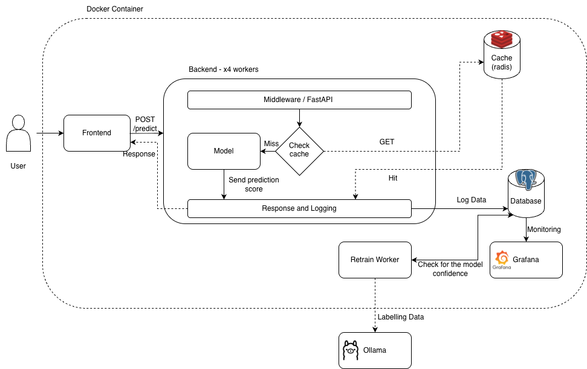
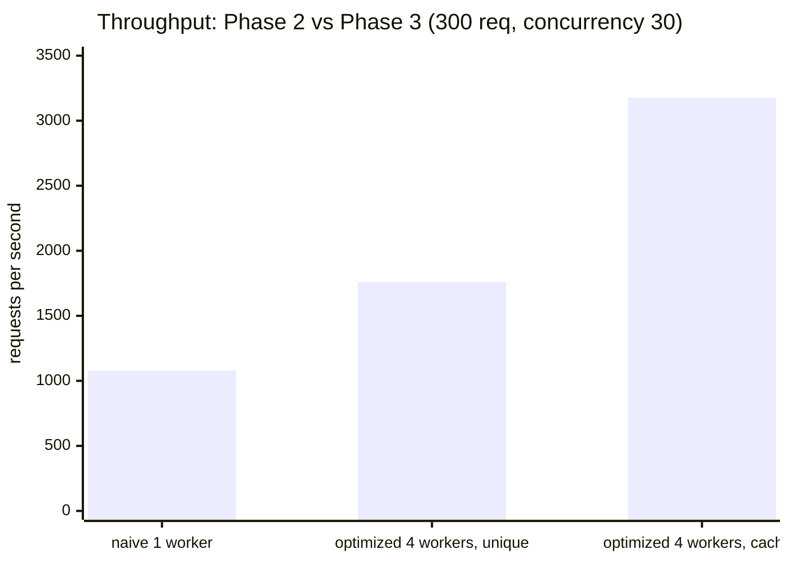
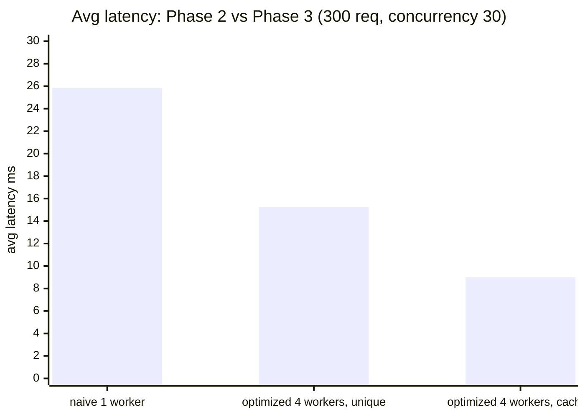
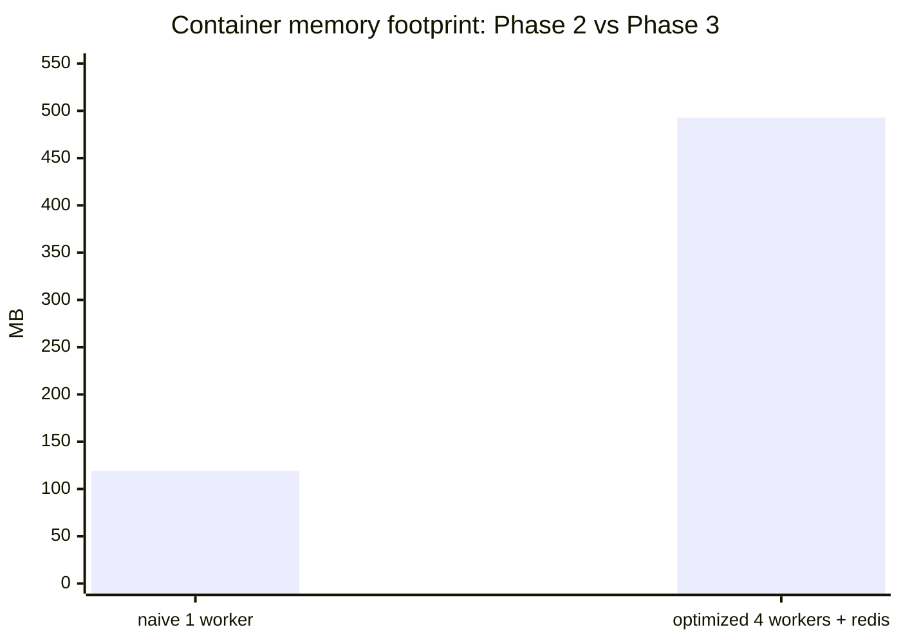

# Milestone 2: API, Frontend, Containerization, CI/CD

Serves the Milestone 1 disaster-tweet classifier (TF-IDF + Logistic
Regression, exported from the notebook) behind a REST API with a web UI.

Inference runs from the ONNX graph, the same format the retraining pipeline
promotes, so what is evaluated offline is what serves production traffic.

## Structure

```
Milestone-2/
  backend/
    app.py              FastAPI app: /predict, /health, /model/info
    database.py         PostgreSQL schema and writers for logs, cycles, versions, drift
    model_store.py      versioned ONNX store, atomic pointer, promotion and rollback
    requirements.txt
    requirements-dev.txt      pytest, httpx, ruff
    requirements-optimize.txt skl2onnx, onnx, onnxruntime, psutil, pandas
    optimize/
      export_onnx.py    exports the pipeline to ONNX FP32
      benchmark.py      naive (joblib) vs ONNX FP32: latency, memory, size, accuracy
      results.json      generated benchmark output
    tests/              unit + integration tests
    Dockerfile
  model/
      model_fp32.onnx   image-bootstrap artifact for /models
  frontend/
    index.html           form UI
    app.js                fetch/formatting logic (testable, no DOM)
    tests/                node:test integration tests
    Dockerfile
  drift.py               drift metrics: PSI, JS distance, OOV rate, length KS
  build_drift_reference.py   freezes the train.csv distribution as the drift baseline
  drift_monitor.py       periodic drift checks, writes to drift_checks
  model_control.py       status / list / rollback for the live model version
  workload_generator.py  synthetic and CSV-driven load for the API
  retraining_trigger.py  standalone time/confidence trigger check
  retrain_cycle.py       label, train, evaluate, export ONNX, promote
  retraining_monitor.py  autonomous trigger loop
  label_with_llm.py      strict binary weak labeling through an LLM API
  grafana/               provisioned datasource and dashboards
  tests/                 drift, model store, retraining cycle, label validation
  docs/retraining-demo.md temporary threshold demo and rollback runbook
  docker-compose.yml
  deploy.sh              one-command launch
```

## Run it

```bash
./deploy.sh
```

Builds both images, starts them, waits for the backend health check, then
prints the URLs:
- Frontend: http://localhost:8080
- Backend docs: http://localhost:8000/docs

Or manually: `docker compose up --build`.

### Generate test workload

With the backend running, generate traffic for the API and Grafana dashboard:

```bash
python workload_generator.py --requests 300 --concurrency 30 --pattern mixed
```

Available traffic patterns:

```bash
python workload_generator.py --requests 300 --concurrency 30 --pattern unique
python workload_generator.py --requests 300 --concurrency 30 --pattern repeated
```

`unique` requests mostly exercise model inference, while `repeated` requests
demonstrate Redis cache hits. The script prints success/failure counts, HTTP
status counts, prediction distribution, throughput, and average/p50/p95/max
latency. Refresh Grafana after the run to observe the generated traffic.

## API

`POST /predict`
```json
{"text": "wildfire forces mass evacuation"}
```
→
```json
{"prediction": 1, "probability": 0.85}
```

`GET /health` → `{"status": "ok"}` (used by the Docker health check).

## Tests

Backend (`cd backend && pytest`): unit tests on the classification
threshold, integration tests hitting `/predict` through FastAPI's
`TestClient` (200 on valid input, correct disaster/non-disaster split,
422 on missing field).

Frontend (`cd frontend && node --test`): integration tests on the
fetch/format logic with a mocked `fetch` (success path, non-200 error,
label formatting).

## Observability and monitoring

The Compose stack includes PostgreSQL for durable request logs and Adminer
for browser-based data inspection, plus Grafana for monitoring dashboards.

Start the stack as usual:

```bash
./deploy.sh
```

Open Adminer at http://localhost:8081 and use:

```text
System:   PostgreSQL
Server:   postgres
Username: postgres
Password: postgres
Database: predictions
```

Open Grafana at http://localhost:3000 and sign in with:

```text
Username: admin
Password: admin
```

**Request Monitoring Dashboard**

- total requests over time;
- average request latency;
- error rate and status-code counts;
- Redis cache-hit rate;
- disaster versus non-disaster predictions;
- per-request disaster probability and derived confidence;
- latest retraining decision and confidence trigger history;
- recent failed requests and error messages;
- **data drift: PSI against the training baseline, with 0.1 / 0.25 threshold
  lines, plus the latest verdict, JS distance, OOV rate, length shift, live vs
  training positive rate, and the top shifted features**;
- **the live model version, its promotion history with metrics, and request
  volume split by serving version**.

Grafana reads PostgreSQL directly through the provisioned datasource. Its
dashboard and datasource configuration live in `grafana/`, so a fresh
`docker compose up` recreates the monitoring setup without manual clicking.

The **Prediction probability and confidence** panel plots the API's stored
`probability` value from 0 to 1. `0.90` means the model assigned a 90%
probability to the disaster class. The confidence line is derived as
`max(probability, 1 - probability)`; values near 0.5 indicate an uncertain
decision.

The retraining section shows whether retraining is currently needed (`1` means
yes and `0` means no), recent average confidence against the configured
threshold, and a table of autonomous monitor decisions. A clean workload with
average confidence `0.739491` and the normal `0.65` threshold should show `0`
and `conditions_not_met`; the monitor checked the batch and correctly decided
not to retrain.

The backend writes one row to `request_logs` for every HTTP request handled
by the API, including validation failures. The table records:

| column | purpose |
|---|---|
| `request_id`, `created_at` | trace identifier and event time |
| `method`, `path` | endpoint information |
| `request_text` | submitted text when available |
| `prediction`, `probability` | model output; null when validation fails |
| `cache_hit` | whether Redis supplied the prediction |
| `status_code`, `latency_ms` | API health and performance monitoring |
| `model_version` | identifies the model used for the prediction |
| `error_message` | error details when request processing fails |

Useful Adminer queries include:

```sql
SELECT * FROM request_logs ORDER BY created_at DESC;

SELECT cache_hit, COUNT(*) AS requests, AVG(latency_ms) AS avg_latency_ms
FROM request_logs
GROUP BY cache_hit;

SELECT status_code, COUNT(*) AS requests
FROM request_logs
GROUP BY status_code
ORDER BY status_code;
```

PostgreSQL data is stored in the `postgres_data` Docker volume, so logs
survive normal container restarts. Logging is fail-open: if PostgreSQL is
temporarily unavailable, prediction requests continue to work and the API
does not depend on the database being available.

## Automated retraining

The retraining monitor periodically checks new successful prediction requests.
It calculates confidence as:

```text
confidence = max(predicted_probability, 1 - predicted_probability)
```

Predictions near `0.5` are uncertain, while predictions near `0` or `1` are
more confident. The monitor waits for the configured minimum number of new
requests, then starts a retraining cycle when that batch's average confidence
is below the configured threshold. The monitor uses this confidence trigger;
`retraining_trigger.py` is a separate one-shot check and is not wired into the
automatic monitor.

The overall retraining logic is:

1. Read recent requests and model outputs from PostgreSQL.
2. Use the configured Ollama model to assign weak labels of only `0` or `1`.
3. Reject invalid or low-confidence labels.
4. Train a candidate model using the original labeled data and accepted new
  examples.
5. Export the candidate to ONNX, matching the format used by the API.
6. Compare the candidate with the currently deployed model on a fixed holdout.
7. Promote the candidate only when it improves the required metrics.
8. Otherwise, keep the current model serving and record the reason.

The deployment choice is therefore made by the evaluation gate, not by the
LLM. The LLM only supplies weak labels; the candidate model is selected based
on its measured ONNX performance. The API then reloads a promoted version from
the shared versioned model store.

For the temporary threshold demo, promotion, rollback, and commands, see
[docs/retraining-demo.md](docs/retraining-demo.md).

The workload generator can use the original Milestone 1 test data
directly. This is the current simulation flow and sends
only the `text` column to the same `/predict` endpoint used by the web
frontend; the backend stores the request and prediction in PostgreSQL:

```bash
python workload_generator.py \
  --requests 100 \
  --concurrency 10
```

Omit `--requests` to send every non-empty row from `test.csv` (3,699 rows in
the current Milestone 1 dataset). Use `--input-csv` only when intentionally
testing another CSV with a `text` column.


### The deployment gate runs on ONNX, not sklearn

The candidate is exported to ONNX and **both** the baseline and the candidate
are scored as ONNX graphs on the same fixed stratified holdout. Promotion
requires all three:

| requirement | reason |
|---|---|
| candidate ONNX F1 > baseline ONNX F1 | the graph is what serves, so the graph is what is judged |
| candidate ONNX recall >= baseline ONNX recall | guards against buying F1 by losing disasters |
| converter skew <= 0.01 accuracy | catches a broken export rather than normal converter loss |

This matters because `skl2onnx` does not reproduce every bigram the fitted
pipeline emits. Measured over the 7,613 training rows:

| export | prediction flips vs sklearn | accuracy delta |
|---|---|---|
| `ngram_range=(1, 1)` | 0 / 7,613 | 0.0000 |
| `ngram_range=(1, 2)` (shipped) | 35 / 7,613 (0.46%) | -0.0020 |

Unigram graphs are exact. With bigrams, a dropped term shrinks the row's L2
norm and inflates its remaining features, so roughly 0.3-0.5% of predictions
cross the 0.5 threshold. The tolerance absorbs that measured behaviour and
rejects anything larger, which would indicate a genuinely broken export.

The default is still a dry run. `--deploy` promotes a winning candidate into
the shared model store; `retraining_monitor.py` passes it automatically when
`RETRAINING_AUTO_DEPLOY` is true (the default).

## Model store, promotion, and rollback

Deployments land in a versioned store on a volume shared by the API and the
retrainer, mounted at `/models`:

```
/models/versions/v0001/model.onnx     every version is kept
/models/versions/v0001/manifest.json  metrics, source, promotion time
/models/current.json                  the single source of truth for what is live
```

`current.json` is replaced with `os.replace`, so a reader sees either the whole
previous pointer or the whole new one. A candidate is staged in a temporary
directory on the same filesystem and moved into place, so a crash mid-write
cannot leave a half-written version pointed at.

**Serving.** The API reads `current.json` on a background poller (5s by default,
`MODEL_POLL_SECONDS`) and rebuilds its inference session when the pointer moves.
Requests never wait on the reload, and if a promoted model fails to load the API
keeps serving the version it already had. Polling rather than a callback keeps
the API decoupled: if the retrainer dies mid-retrain, serving is unaffected.

**Promotion.** The retrainer writes `v<N>` then flips the pointer, and records
the version in `model_versions`. `request_logs.model_version` is now the real
serving version instead of a static environment variable, so traffic can be
attributed to the model that produced it.

**Cache correctness.** Redis keys include the model version
(`predict:<version>:<sha256>`). Without the version in the key, a newly
promoted model would keep returning the previous model's cached predictions
until the TTL expired.

**Rollback.** Repointing at the previous version is the whole operation:

```bash
python model_control.py status                     # what is live now
python model_control.py list                       # every stored version + metrics
python model_control.py rollback --reason "recall regressed in production"
curl -s localhost:8000/model/info                  # what the API is actually serving
```

The API picks up the rollback on its next poll. `manifest.json` survives for the
replaced version, so a rollback is not a rebuild and costs one file write.
Every version records the one it replaced, so rollback is a single hop, and
promoting the live version again is rejected rather than silently creating a
self-referential pointer.

Rollback also flips the `active` flag in `model_versions` so the Grafana version
panel keeps matching reality. That write is best-effort: it is skipped when
`DATABASE_URL` is unset and it warns instead of raising, because the pointer flip
is what serves traffic and must never be blocked by the audit trail.

The first boot seeds `v0001` from `model/model_fp32.onnx` in the backend
image, so the stack runs the Milestone 3 model with no manual step.

## Data drift

Live traffic is unlabeled, so data drift compares incoming text with the
original training distribution. It helps detect when production language no
longer looks like the data used to train the model.

`build_drift_reference.py` creates a reference from the original training data.
The drift monitor compares each recent request window with that reference and
writes the results to `drift_checks`.

```bash
python build_drift_reference.py \
  --training-data ../Milestone-1/nlp-getting-started/train.csv \
  --output artifacts/drift_reference.joblib
```

The reference is independent of the served model, so promoting a new model does
not redefine the baseline. Grafana compares each live window with the frozen
training data. The signals answer different questions:

| Dashboard signal | What it measures | How to read it |
|---|---|---|
| **PSI and verdict** | Overall change in TF-IDF feature mass. This implementation groups the 5,000 features into ten buckets based on their training frequency, then compares bucket shares. | This is the dashboard's thresholded summary: **below 0.1** stable, **0.1–0.25** moderate, **above 0.25** significant. These are alert heuristics; investigate sustained or rising values. |
| **Jensen–Shannon (JS) distance** | Difference between the full training and live TF-IDF frequency distributions. It ranges from **0** (identical) to **1** (maximally different). | Treat it as a trend, not a pass/fail score. With this sparse 5,000-feature text representation, same-domain windows have measured around **0.40** from sampling noise; strongly off-domain windows can approach **0.99**. Compare similarly sized windows over time. A rising distance suggests the vocabulary mix is changing broadly. |
| **OOV rate** | Share of live word tokens that do not appear in the training text vocabulary. It counts individual words, not word pairs. | **0.10** means roughly 10% of tokens are unseen. A higher or rising rate means more incoming language falls outside what training data covered. Some unseen words are normal, so use it with the other signals. |
| **Text length KS statistic** | Largest gap between the training and live cumulative distributions of character counts, using the two-sample Kolmogorov–Smirnov statistic. | It ranges from **0** (similar length distributions) toward **1** (large separation). Near 0 means lengths look similar; a rising value means texts are shifting shorter or longer. |
| **Live vs training positive rate** | The share of live predictions classified as disaster compared with the positive-label share in the original training data. | A gap signals that the model's output mix changed. Since live requests have no ground-truth labels, this is not an accuracy or error-rate measure by itself. |
| **Top shifted features** | Words or phrases with the largest per-feature PSI contribution between the training and live windows. | Use these as clues about what changed (for example, new place names or event terms). They are examples to investigate, not proof that one term caused model errors. |

For example, a PSI verdict of **stable** with a JS distance around **0.40** and
a modest OOV rate can be consistent with ordinary same-domain traffic. A JS
distance near **0.99** together with high OOV and a significant PSI verdict is
stronger evidence that the text has moved well outside the training language.
The drift dashboard describes changes in inputs and predictions; it cannot tell
whether the model is less accurate without ground-truth labels.

## Verification

The following local checks passed on October 6, 2026. API integration tests
use FastAPI's test client and an isolated temporary model store.

| check | result |
|---|---|
| `pytest -q tests backend/tests` | 76 passed |
| `ruff check backend` | clean |
| `ruff check backend *.py tests` | clean |
| `node --test frontend/tests/app.test.js` | 3 passed |
| `bash -n deploy.sh demo-retrain.sh` | clean |
| `docker compose config --quiet` | valid |

The demo retraining script was syntax checked; an LLM retraining attempt was
not run as part of these checks.

## CI

`.github/workflows/ci.yml` runs on every push/PR to `main` with three jobs:
backend lint and tests, frontend `node --test`, and a `pipeline` job that lints
and tests the Milestone 4 code in `Milestone-2/` (drift, model store,
retraining cycle, and strict LLM label validation), which lives outside `backend/` and so was
previously uncovered.

## Model-level optimization

**ONNX FP32 export.** `optimize/export_onnx.py` converts
   the fitted `Pipeline(vectorizer, model)` to ONNX via `skl2onnx`, so
   inference runs through `onnxruntime` instead of sklearn's Python path.

The API serves and the retraining pipeline promotes this FP32 ONNX model. The
benchmark compares it with the original joblib model; no INT8 model is used.

Run these commands from `Milestone-2/backend/`:
```bash
pip install -r requirements-optimize.txt
python optimize/export_onnx.py     # writes ../model/model_fp32.onnx
python optimize/benchmark.py --n 500
```

`benchmark.py` sends the same batch of 500 held-out tweets through the naive
joblib and ONNX FP32 models. Each runs in its own subprocess and reports
average latency, throughput, process RSS after model load, on-disk size, and
accuracy.

### Results (n=500 requests)

| mode      | avg latency (ms) | throughput (qps) | RSS after load (MB) | size (KB) | accuracy |
|-----------|-------------------|-------------------|-----------------------|-----------|----------|
| naive (joblib)  | 0.299 | 3,341  | 154.1 | 227.5 | 0.856 |
| ONNX FP32       | 0.032 | 31,157 | 171.1 | 160.1 | 0.858 |

Full numbers in `optimize/results.json`.

**Takeaways:**
- The ONNX export is the bigger win here: ~9x higher throughput than the
  sklearn/joblib path, no accuracy loss.
- RSS after load is slightly *higher* for the ONNX modes than naive — that's
  fixed overhead from importing `onnxruntime` itself (numpy, protobuf, the
  runtime's own allocator warmup), not the model. It dominates at this model
  size; it wouldn't for a model large enough to actually stress memory.

## System architecture

The browser frontend sends prediction requests to the FastAPI backend. The
backend checks Redis and runs the ONNX model on a cache miss. PostgreSQL is a
separate service used by the API and background workers; Grafana reads its
monitoring data. The retraining worker can promote a model through the shared
model store, which the API workers check for updates.



The frontend is a static page: a UI and the small fetch wrapper that calls the
backend. No model, no database access, no server logic — everything happens
behind the backend's `POST /predict`.

Inside the backend, `api` and `workers` are the same application. Gunicorn runs
FastAPI with `-w 4`, so there are 4 worker processes and each one handles a
request from entry to exit: check the cache, run the model on a miss, return the
result. The model is held in memory once per worker.

The database holds four tables. `request_logs` is the one the request path
writes, and it grows on every call. The other three are written by background
jobs. Grafana connects as a read-only consumer through its provisioned
PostgreSQL datasource (`grafana/provisioning/datasources/postgres.yml`), so it
never appears in a write path and never affects serving latency. All 21 panels
are `SELECT` queries against these four tables.

Inside the backend, `api` and `workers` are the same application. Gunicorn runs
FastAPI with `-w 4`, so there are 4 worker processes and each one handles a
request from entry to exit: check the cache, run the model on a miss, return the
result. The model is held in memory once per worker.

### Request flow

1. The user interacts with the client-side frontend in a browser.
2. The frontend sends `POST /predict` with a JSON body (`{"text": "..."}`) to the
   server-side FastAPI application server. The user never connects directly to
   a worker, and there is no separate GET for the result.
3. Gunicorn hands the connection to one of the 4 workers. That worker does the
   rest of the work itself — there is no dispatch hop inside the backend.
4. The worker checks Redis, keyed by a hash of the text plus the live model
   version, and runs ONNX inference on a cache miss.
5. The worker returns `{"prediction": 0|1, "probability": float}` as the response
   to the original `POST /predict`. The frontend renders it for the user.
6. An HTTP middleware in the same worker process writes request, prediction,
   cache-hit, latency, and model-version metadata to PostgreSQL.

`GET /health` is used by the container health check, and `GET /model/info`
reports the model version currently loaded by the API.

### Learning flow

1. The retraining worker (`retraining_monitor.py`) polls `request_logs` for new
   rows where `path = '/predict'` and `status_code = 200`.
2. It keeps a `last_processed_id` cursor in its own state volume, so a restart
   does not reprocess rows.
3. Once a batch reaches `RETRAINING_MINIMUM_ROWS` and its mean probability falls
   below `RETRAINING_CONFIDENCE_THRESHOLD`, it invokes `retrain_cycle.py`.
4. `retrain_cycle.py` sends the low-confidence rows to the LLM endpoint
   (`LLM_PROVIDER=ollama`, default `LLM_BASE_URL` is the host's port 11434, so
   Ollama runs outside the compose network) and keeps only labels above
   `RETRAINING_LABEL_CONFIDENCE`.
5. The candidate is trained, exported to ONNX, and evaluated for accuracy, F1,
   disaster recall, and conversion skew against the holdout set.
6. A passing candidate is atomically promoted in the versioned model store when
   `RETRAINING_AUTO_DEPLOY` is set; otherwise it is reported and not deployed.
7. Each API worker polls `current.json` every `MODEL_POLL_SECONDS` and swaps its
   own ONNX session, without restarting or dropping requests.

The drift monitor runs separately and only observes. It computes PSI, JS
divergence, OOV rate, and a length KS test over a recent window, then writes the
result to PostgreSQL for Grafana. It does not trigger retraining.

The four API workers provide process-level concurrency, Redis reduces repeated
inference, and the model store keeps promotion and rollback independent from
the request-serving path.

### Benchmark: Phase 2 (naive) vs Phase 3 (optimized)

`benchmark_system.py` load-tests a running backend over real HTTP (not
in-process, unlike `optimize/benchmark.py` above) — 300 requests at
concurrency 30, via `ThreadPoolExecutor` + stdlib `urllib`. Phase 2 is the
pre-Week-6 backend (single `uvicorn` process, no cache — checked out from
git history and built standalone). Phase 3 is the current backend (4
`gunicorn`/uvicorn workers + Redis). Two traffic patterns isolate each
technique's effect: **unique** text every request (always a cache miss,
shows the concurrency win alone) and **repeated** identical text (cache hit
after the first request, shows the caching win on top).

Memory is each container's RSS via `docker stats --no-stream`.

Run it (after starting both a naive container on :8001 and the optimized
stack on :8000):
```bash
python benchmark_system.py
```

| scenario                        | throughput (req/s) | avg latency (ms) | p50 (ms) | p95 (ms) | container memory (MB) |
|----------------------------------|--------------------:|-------------------:|-----------:|-----------:|------------------------:|
| Phase 2: naive, 1 worker         | 1,080               | 25.85              | 25.64      | 32.66      | 119.3                   |
| Phase 3: optimized, unique text  | 1,759               | 15.27              | 8.77       | 82.05      | 492.9                   |
| Phase 3: optimized, repeated text| 3,177               | 9.00               | 8.52       | 15.41      | 492.9                   |

Full numbers in `benchmark_system_results.json`.


```mermaid
xychart-beta
    title "Throughput: Phase 2 vs Phase 3 (300 req, concurrency 30)"
    x-axis ["naive 1 worker", "optimized 4 workers, unique", "optimized 4 workers, cached"]
    y-axis "requests per second" 0 --> 3500
    bar [1079, 1759, 3177]
```


```mermaid
xychart-beta
    title "Avg latency: Phase 2 vs Phase 3 (300 req, concurrency 30)"
    x-axis ["naive 1 worker", "optimized 4 workers, unique", "optimized 4 workers, cached"]
    y-axis "avg latency ms" 0 --> 30
    bar [25.85, 15.27, 9.0]
```


```mermaid
xychart-beta
    title "Container memory footprint: Phase 2 vs Phase 3"
    x-axis ["naive 1 worker", "optimized 4 workers + redis"]
    y-axis "MB" 0 --> 550
    bar [119.3, 492.9]
```

## Demo

The Milestone 2 walkthrough video is below. The Milestone 4 flow, in order:

```bash
./deploy.sh                     # postgres, redis, grafana, backend, retrainer, drift-monitor
python workload_generator.py --requests 300 --concurrency 30
./demo-retrain.sh 150            # sends 150 synthetic requests, then restores threshold to 0.65
```

1. **Monitoring:** Open Grafana at http://localhost:3000 using `admin/admin`.
2. **Drift:** Send off-domain traffic and observe the drift panels.
3. **Retraining:** Follow [docs/retraining-demo.md](docs/retraining-demo.md) to
   trigger a temporary retraining cycle.
4. **Rollback:** Restore the previous model version:

    ```bash
    docker compose exec retrainer python model_control.py list
    docker compose exec retrainer python model_control.py rollback \
      --reason "demo: recall regression"
    curl -s localhost:8000/model/info
    ```


https://github.com/user-attachments/assets/f627b451-f586-49e9-860b-9dafcece695e
